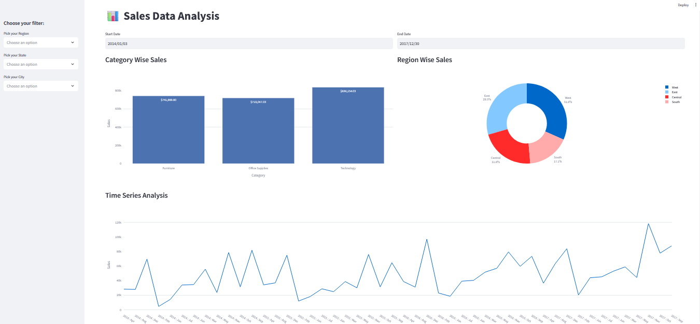

# Sales Data Analysis

## Project Summary
The goal of this project is to analyze the Adidas dataset on Sales. The dataset contains year-wise (2014-2017) information on the sales and profit of Adidas items.

## Tech Stack 
- Python
- Pandas
- Streamlit
- Plotly
- Matplotlib
